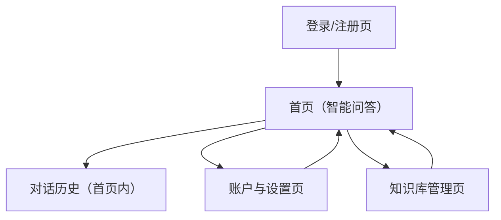

## 1. Product Overview
面向团队与个人的“基于 LangChain 的智能问答系统”，支持将内部资料构建为知识库并进行可追溯问答。
核心价值：降低资料检索成本，提升回答一致性与可控性（来源引用、权限隔离、反馈迭代）。

## 2. Core Features

### 2.1 User Roles
| 角色 | 注册/开通方式 | 核心权限 |
|------|--------------|----------|
| 访客 | 无需注册 | 可查看产品介绍；不可使用知识库问答 |
| 普通用户 | 邮箱+密码注册/登录 | 选择可访问的知识库进行问答；查看自身对话记录 |
| 管理员 | 由系统配置/邀请升级 | 创建/编辑/删除知识库；上传/删除文档；管理可访问范围；查看问答质量反馈 |

### 2.2 Feature Module
本系统由以下页面构成：
1. **登录/注册页**：账号登录、注册、退出。
2. **首页（智能问答）**：知识库选择、提问与回答、引用来源展示、对话历史。
3. **知识库管理页**：知识库列表、知识库配置、文档上传与处理状态、文档管理。
4. **账户与设置页**：个人信息、API/模型策略展示（只读）、数据与隐私设置。

### 2.3 Page Details
| Page Name | Module Name | Feature description |
|-----------|-------------|---------------------|
| 登录/注册页 | 登录与注册 | 支持邮箱+密码注册、登录；显示错误信息；成功后跳转到首页 |
| 登录/注册页 | 会话管理 | 支持退出登录；未登录访问受限页面时引导登录 |
| 首页（智能问答） | 知识库选择 | 列出你有权限的知识库；支持切换当前会话的知识库上下文 |
| 首页（智能问答） | 问答交互 | 提交问题；流式/分段展示回答；支持“继续追问”保持上下文 |
| 首页（智能问答） | 引用与可追溯 | 展示回答引用的文档片段（标题/来源/片段）；点击可打开片段详情/原文定位 |
| 首页（智能问答） | 对话历史 | 按时间列出你的历史会话；支持打开继续对话；支持删除单个会话 |
| 首页（智能问答） | 反馈闭环 | 对回答进行有用/无用反馈；可选填写原因（缺失/不准确/无引用等） |
| 知识库管理页 | 知识库管理 | 创建/编辑/删除知识库；配置：名称、描述、可见范围（全员/仅管理员/指定用户） |
| 知识库管理页 | 文档上传与解析 | 上传文件到指定知识库；展示处理状态（已上传/切分中/向量化中/可用/失败） |
| 知识库管理页 | 文档与片段管理 | 列表查看文档；支持删除文档；查看该文档的片段数量与最近更新时间 |
| 账户与设置页 | 账户信息 | 展示邮箱、角色；支持修改密码/找回密码入口 |
| 账户与设置页 | 隐私与数据 | 说明数据使用范围；支持导出/删除你的对话记录（异步任务或后台处理） |

## 3. Core Process
- 普通用户流程：注册/登录 → 进入首页 → 选择知识库 → 提问 → 查看回答与引用 → 反馈质量 → 在历史中继续对话或删除会话。
- 管理员流程：登录 → 进入知识库管理 → 创建知识库 → 上传文档 → 等待处理完成 → 回到首页进行验证提问 → 根据反馈迭代文档与知识库配置。

## 4. 扩展规划（Roadmap）
- 知识库能力：更多文档类型解析（网页/Markdown/数据库导入）、定时增量同步、文档版本与回滚。
- 检索增强：多路召回（关键词+向量）、重排（rerank）、查询改写与多轮检索。
- 质量与治理：回答置信度与风险提示、黑白名单词表、敏感信息脱敏、审计与运营报表。
- 协作与权限：按团队/项目空间隔离；更细粒度的成员管理与访问控制。
- 生产化：多模型策略（按成本/质量路由）、缓存与限流、可观测性（trace/metrics）。
