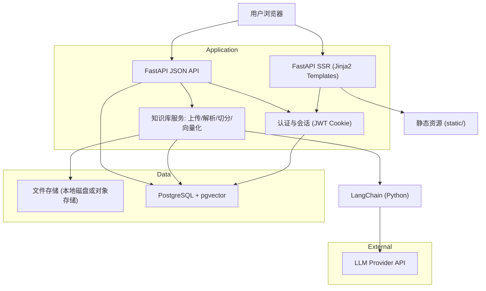
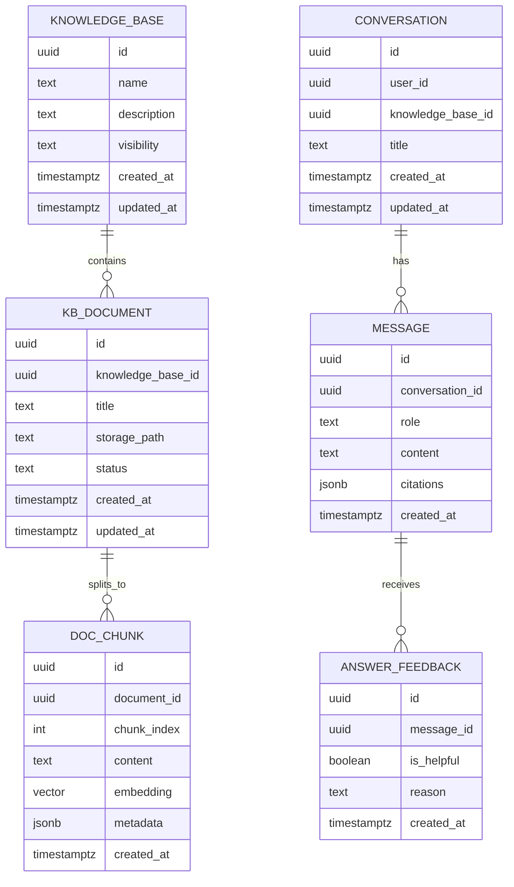

## 1.Architecture design


## 2.Technology Description
- Frontend: FastAPI SSR（Jinja2 模板渲染）+ 原生 HTML/CSS/JS（不做前后端分离）
- Backend: Python + FastAPI（页面路由 + REST API）+ LangChain（Python）
- Database: PostgreSQL + pgvector
- Auth: JWT（HttpOnly Cookie）+ bcrypt
- File parsing: txt/pdf/docx 解析 + 文本分块（RecursiveCharacterTextSplitter）

## 3.Route definitions
| Route | Purpose |
|-------|---------|
| /login | 登录页（邮箱+密码） |
| /register | 注册页（邮箱验证、姓名、密码强度） |
| /forgot | 找回密码（发送重置链接） |
| /reset | 重置密码（通过 token） |
| / | 首页（智能问答）：提问、回答、引用、对话历史 |
| /kb | 知识库管理：知识库列表、创建 |
| /kb/{id} | 知识库详情：上传、文档列表、配置 |
| /settings | 账户与设置：账号、角色、数据导出/删除 |

## 4.API definitions (If it includes backend services)
### 4.1 Core API
问答（RAG）
```
POST /api/chat
```
Request
| Param Name | Param Type | isRequired | Description |
|-----------|------------|------------|-------------|
| knowledgeBaseId | string | true | 目标知识库 ID |
| conversationId | string | false | 会话 ID（续聊） |
| message | string | true | 用户问题 |

Response
| Param Name | Param Type | Description |
|-----------|------------|-------------|
| answer | string | 模型回答 |
| citations | {chunkId:string, documentId:string, title:string, snippet:string}[] | 引用片段 |
| conversationId | string | 会话 ID |

文档入库（上传后异步/同步处理）
```
POST /api/kb/{knowledgeBaseId}/documents
```
Request
| Param Name | Param Type | isRequired | Description |
|-----------|------------|------------|-------------|
| knowledgeBaseId | string | true | 知识库 ID |
| storagePath | string | true | Storage 内文件路径 |
| filename | string | true | 文件名 |

Response
| Param Name | Param Type | Description |
|-----------|------------|-------------|
| documentId | string | 文档 ID |
| status | "queued" | 已进入处理队列 |

### 4.2 Shared TypeScript Types
本项目以 Python 为主，不强制共享 TypeScript types；API 返回体通过 FastAPI OpenAPI 自动生成。

## 6.Data model(if applicable)
### 6.1 Data model definition


### 6.2 Data Definition Language
Knowledge Base（knowledge_bases）
```
CREATE TABLE knowledge_bases (
  id UUID PRIMARY KEY DEFAULT gen_random_uuid(),
  name TEXT NOT NULL,
  description TEXT,
  visibility TEXT NOT NULL DEFAULT 'private' CHECK (visibility IN ('private','org','admins')),
  created_at TIMESTAMP WITH TIME ZONE DEFAULT NOW(),
  updated_at TIMESTAMP WITH TIME ZONE DEFAULT NOW()
);

GRANT SELECT ON knowledge_bases TO anon;
GRANT ALL PRIVILEGES ON knowledge_bases TO authenticated;
```

Documents（kb_documents）
```
CREATE TABLE kb_documents (
  id UUID PRIMARY KEY DEFAULT gen_random_uuid(),
  knowledge_base_id UUID NOT NULL,
  title TEXT NOT NULL,
  storage_path TEXT NOT NULL,
  status TEXT NOT NULL DEFAULT 'uploaded' CHECK (status IN ('uploaded','chunking','embedding','ready','failed')),
  created_at TIMESTAMP WITH TIME ZONE DEFAULT NOW(),
  updated_at TIMESTAMP WITH TIME ZONE DEFAULT NOW()
);

CREATE INDEX idx_kb_documents_kb_id ON kb_documents(knowledge_base_id);

GRANT SELECT ON kb_documents TO anon;
GRANT ALL PRIVILEGES ON kb_documents TO authenticated;
```

Chunks（doc_chunks，需启用 pgvector 并按 embedding 维度设置）
```
CREATE TABLE doc_chunks (
  id UUID PRIMARY KEY DEFAULT gen_random_uuid(),
  document_id UUID NOT NULL,
  chunk_index INT NOT NULL,
  content TEXT NOT NULL,
  embedding VECTOR(1536),
  metadata JSONB,
  created_at TIMESTAMP WITH TIME ZONE DEFAULT NOW()
);

CREATE INDEX idx_doc_chunks_document_id ON doc_chunks(document_id);

GRANT SELECT ON doc_chunks TO anon;
GRANT ALL PRIVILEGES ON doc_chunks TO authenticated;
```

Conversations / Messages / Feedback
```
CREATE TABLE conversations (
  id UUID PRIMARY KEY DEFAULT gen_random_uuid(),
  user_id UUID NOT NULL,
  knowledge_base_id UUID NOT NULL,
  title TEXT,
  created_at TIMESTAMP WITH TIME ZONE DEFAULT NOW(),
  updated_at TIMESTAMP WITH TIME ZONE DEFAULT NOW()
);

CREATE TABLE messages (
  id UUID PRIMARY KEY DEFAULT gen_random_uuid(),
  conversation_id UUID NOT NULL,
  role TEXT NOT NULL CHECK (role IN ('user','assistant')),
  content TEXT NOT NULL,
  citations JSONB,
  created_at TIMESTAMP WITH TIME ZONE DEFAULT NOW()
);

CREATE TABLE answer_feedback (
  id UUID PRIMARY KEY DEFAULT gen_random_uuid(),
  message_id UUID NOT NULL,
  is_helpful BOOLEAN NOT NULL,
  reason TEXT,
  created_at TIMESTAMP WITH TIME ZONE DEFAULT NOW()
);

CREATE INDEX idx_conversations_user_id ON conversations(user_id);
CREATE INDEX idx_messages_conversation_id ON messages(conversation_id);

GRANT SELECT ON conversations, messages, answer_feedback TO anon;
GRANT ALL PRIVILEGES ON conversations, messages, answer_feedback TO authenticated;
```
